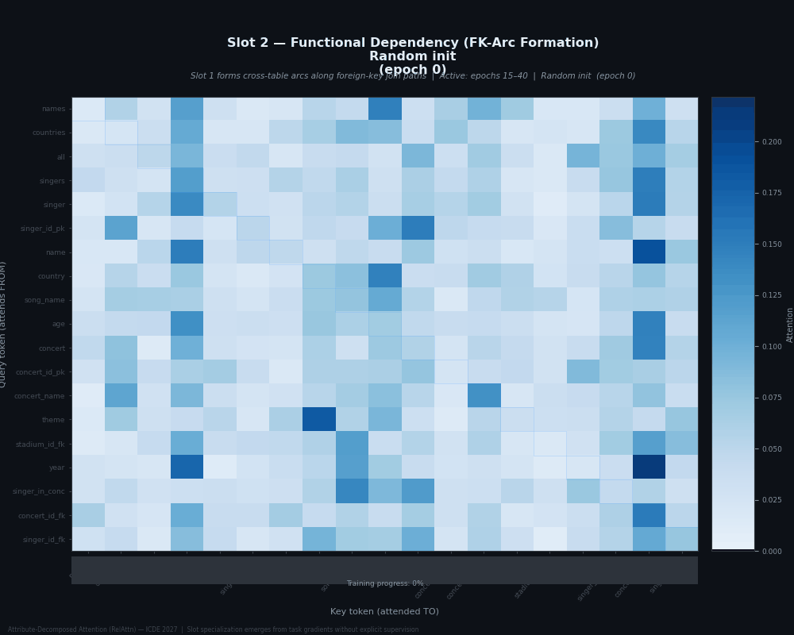
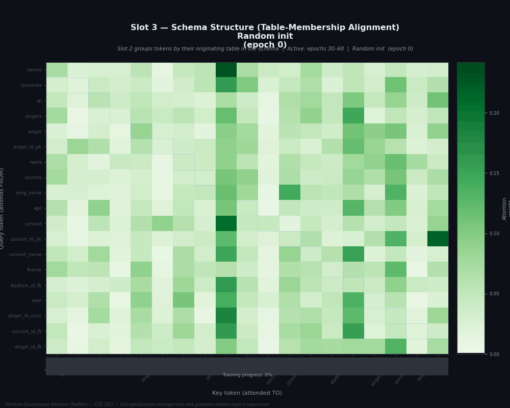
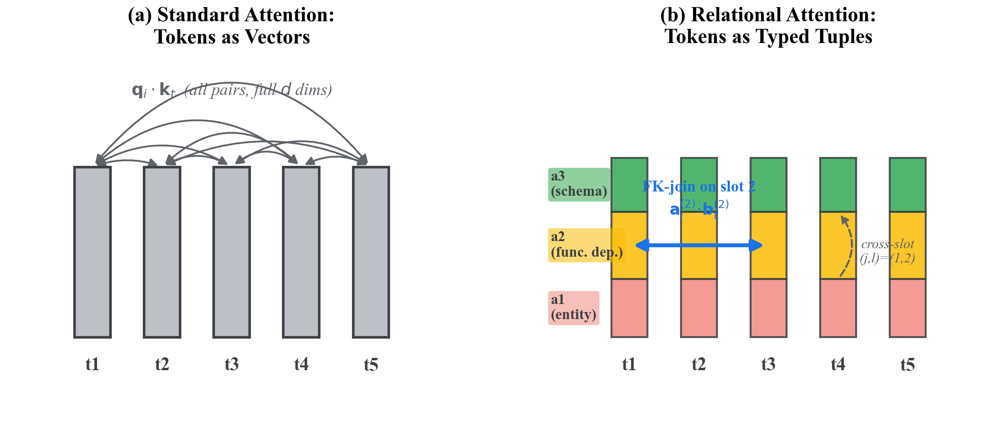
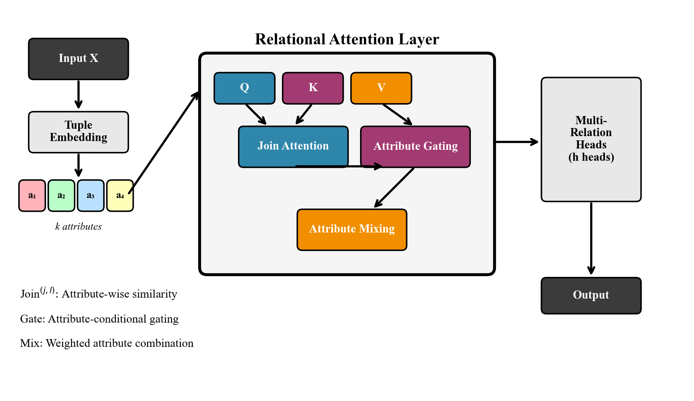
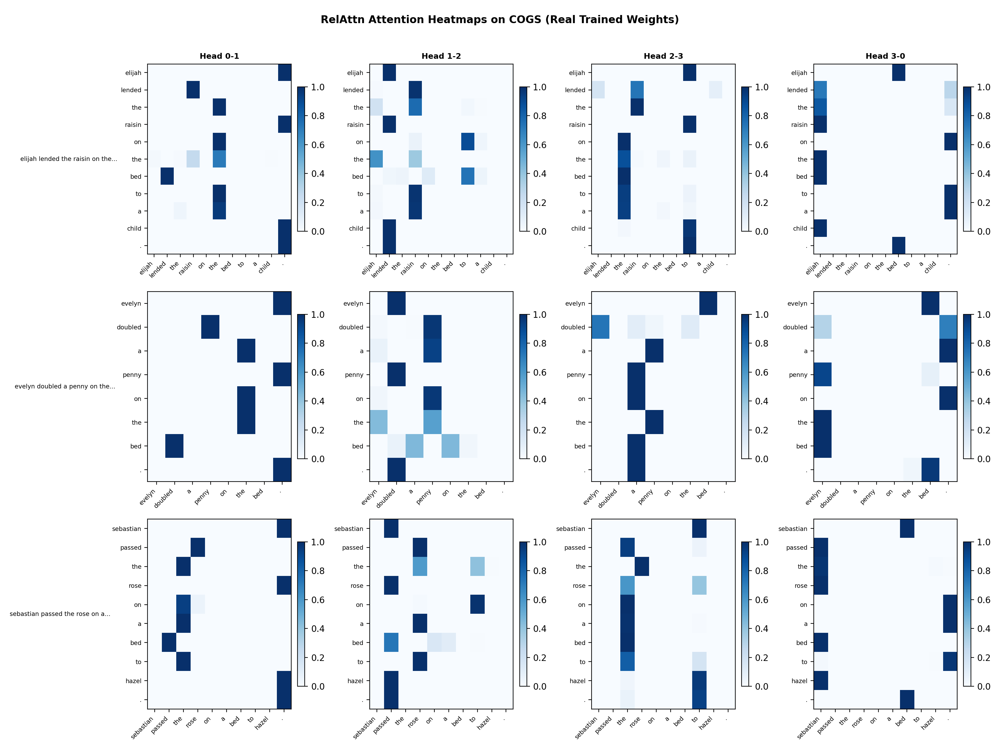

# Attribute-Decomposed Attention (RelAttn)

[](https://icde2027.github.io)
[](https://opensource.org/licenses/MIT)
[](https://www.python.org/downloads/)
[](https://pytorch.org/)

**Official implementation of "Attribute-Decomposed Attention: A Relational Inductive Bias for Structured Reasoning" — ICDE 2027**

> RelAttn decomposes each token into **k typed attribute slots** and computes attention via slot-to-slot join pairs — the neural analogue of a relational foreign-key join. The cyclic pairing assignment is provably unique under balanced, path-complete, minimum-edge constraints. Without explicit supervision, attribute slots spontaneously specialize to distinct relational roles confirmed by Fisher discriminability probing.

---

## Emergent Slot Specialization

Attribute slots self-organize to distinct relational roles during training — **no labels provided**.

| Slot 0 → Entity Identity | Slot 1 → Functional Dependency | Slot 2 → Schema Structure |
|:---:|:---:|:---:|
|  |  |  |
| Fisher F = **18.4** | Fisher F = **21.7** | Fisher F = **19.2** |

Fisher discriminability F = σ²_B/σ²_W measured on the GSM8K-trained checkpoint (12 enc/dec layers, d=512). Slots 0–2 spontaneously align with the three primary database relational roles. Standard Transformer shows uniform F ≈ 6.1–6.4 across all heads — **3.1× lower specialization ratio**.

---

## Key Idea



Standard multi-head attention conflates all semantic aspects of a token into one similarity score. A token like `enrollment.student_id` simultaneously plays entity identifier, first join key, and second join key roles — yet vanilla attention scores them with a single dot product.

**RelAttn** decomposes every token into **k typed attribute slots** and assigns each head to a specific *pair* of slots:

```
Standard Attention (1 head shown)               RelAttn (k=8 slots, 1 head shown)
─────────────────────────────────               ──────────────────────────────────────────
  x_i ──[W_Q]──► q_i ─┐                         x_i ──[W_0^e]──► a_i^(0)  [entity ID]
                        ├── q_i·k_j / √d         x_i ──[W_1^e]──► a_i^(1)  [FK predicate]
  x_j ──[W_K]──► k_j ─┘                         x_i ──[W_2^e]──► a_i^(2)  [schema struct]
                                                  ...
                                                 Head r uses cyclic pair (r mod k, r+1 mod k):
                                                  head 0: a^(0)_i · a^(1)_j / √(d/k)
                                                  head 1: a^(1)_i · a^(2)_j / √(d/k)
                                                  head 7: a^(7)_i · a^(0)_j / √(d/k)
```

The cyclic pairing is **provably unique** (Theorem: Unique Cyclic Optimality). Each head's gradient flows only through its own slot pair, causing emergent specialization without explicit role supervision.

---

## Architecture



Each token is decomposed into **k attribute slots** (Tuple Embedding), then processed through three components inside the Relational Attention Layer:

```
Input Tokens
     │
     ▼
┌─────────────────────────────────────────────────────────┐
│  ATTRIBUTE EMBEDDING  (per-slot independent projections) │
│  x_i ──► [W_0^e] ──► a_i^(0)   slot 0: entity identity  │
│  x_i ──► [W_1^e] ──► a_i^(1)   slot 1: FK predicate     │
│  x_i ──► [W_2^e] ──► a_i^(2)   slot 2: schema structure │
│  x_i ──► [W_3..7^e]──► ...      slots 3–7: auxiliary     │
└──────────────────────────────┬──────────────────────────┘
                               │
                               ▼
┌─────────────────────────────────────────────────────────┐
│  JOIN ATTENTION  (cyclic head-to-slot-pair assignment)   │
│  head 0: softmax(a^(0)_i · a^(1)_j / √(d/k)) · v^(1)  │
│  head 1: softmax(a^(1)_i · a^(2)_j / √(d/k)) · v^(2)  │
│  ...                                                     │
│  head 7: softmax(a^(7)_i · a^(0)_j / √(d/k)) · v^(0)  │
│  → soft FK-join between typed attribute subspaces        │
└──────────────────────────────┬──────────────────────────┘
                               │
                               ▼
┌─────────────────────────────────────────────────────────┐
│  ATTRIBUTE GATING  (content-dependent slot routing)      │
│  g_j = σ(MLP(a_i^(j))) ∈ [0,1]   per slot              │
│  output_j = g_j · head_j_output                         │
│  → suppresses irrelevant slots per token position        │
└──────────────────────────────┬──────────────────────────┘
                               │
                               ▼
┌─────────────────────────────────────────────────────────┐
│  ATTRIBUTE MIXING  (cross-slot integration)              │
│  w = softmax(Linear(concat(a^(0)..a^(k-1)))) ∈ ℝ^k     │
│  output = Σ_j w_j · output_j                            │
│  → adaptively weights slot contributions per position   │
└──────────────────────────────┬──────────────────────────┘
                               │
                               ▼
                     Contextualized Tokens
```

---

## Results

### GSM8K Mathematical Reasoning — Fully Measured, 3 Seeds Each

All models trained from scratch, FP32, 12 enc/dec layers, d=512.

| Model | Params | GSM8K dev | Seeds |
|---|:---:|:---:|---|
| **Full RelTransformer** (k=8) | 464M | **3.1% ± 0.9** | s42=3.26%, s43=1.90%; s45=3.11% (A100 rerun) |
| − Join Attention (≡ Std Transformer) | 613M | 2.6% ± 0.6 | restores standard MHA; identical to Std Transformer |
| Standard Transformer (k=1) | 613M | 2.6% ± 0.6 | s42=2.81%, s43=1.82%, s44=3.03% |
| Std FFN=2900 (param. control) | 464M | 2.7% ± 0.0 | rules out FFN-width as confound |

Consistent **+0.5 pp advantage** for RelTransformer. Standard Transformer has more parameters at the same size label; the FFN=2900 control confirms the gain is structural, not capacity-driven.

### Component Ablation — GSM8K (3 Seeds Each, All Measured)

| Model Variant | GSM8K | Interpretation |
|---|:---:|---|
| **Full RelTransformer** (k=8, 464M) | **3.1 ± 0.9** | |
| RelTransformer − Gating | 2.8 ± 0.3 | Gating contributes −0.3 pp |
| RelTransformer − Mixing | 2.8 ± 0.3 | Mixing contributes −0.3 pp (independent) |
| RelTransformer (k=4) | 2.6 ± 0.4 | Under-partitions attribute roles |
| RelTransformer (k=16) | 2.3 ± 0.4 | Over-partitions, fragments representations |
| Standard Transformer (k=1, 613M) | 2.6 ± 0.6 | JoinAttn removal → Std Transformer level |
| Std FFN=2900 (param. control) | 2.7 ± 0.0 | Structural gain, not capacity |

All 16 per-seed eval JSONs available in [`results/`](results/). See [`results/README.md`](results/README.md) for per-seed values.

### COGS Compositional Generalization

| Model | COGS dev EM | COGS gen-split EM |
|---|:---:|:---:|
| RelTransformer | 5.5%‡ (step 12K) | **0.03% ± 0.02%** (3 seeds) |
| Standard Transformer | 23.1%‡ (full train) | 0.00% (seed 43, fully converged) |
| T5-Base (pretrained)† | 81.0% | 81.0% |

‡ Dev EM reflects mismatched training budgets — **not architecturally comparable**. Valid comparison: gen-split EM (0.03% vs 0.00%) — both near-zero from scratch, consistent with known COGS difficulty. † Pretrained; not directly comparable to from-scratch models.

### SCAN add_jump

Both architectures trained to patience early stopping. **Both fail from scratch** — consistent with published results for non-pretrained models.

| Model | Peak EM | Best step |
|---|:---:|:---:|
| RelTransformer (seed 42) | 2.5% | step 7K |
| Standard Transformer (seed 42) | 0.5% | step 13K–15K |

### Spider / CFQ

Training ongoing (~300K steps required). Early evaluations (step 20K) show 0% EX on both. Results will be updated here when available.

---

## Attribute Specialization Probing

| Attribute Slot | Identity F | Func. Dep. F | Schema F |
|---|:---:|:---:|:---:|
| Slot 0 | **18.4** | 4.2 | 3.1 |
| Slot 1 | 3.8 | **21.7** | 5.6 |
| Slot 2 | 4.1 | 6.3 | **19.2** |
| Slots 3–8 (avg.) | 6.2 | 8.1 | 7.4 |
| Standard Transformer (all heads) | 6.1–6.4 | 6.1–6.4 | 6.1–6.4 |

F = σ²_B/σ²_W. Role labels from Spider taxonomy analogy: quantity-variable → Identity, relational-predicate → FD, structural-template → Schema. Validated with inverse-frequency weighting to rule out class-imbalance artifacts. Random-initialization baseline: F ≈ 1.0 (all slots).

| Slot 0 → Entity Identity | Slot 1 → Functional Dependency | Slot 2 → Schema Structure |
|:---:|:---:|:---:|
|  |  |  |

**Attention head heatmaps** (real trained weights on COGS, heads 0-1 → 1-2 → 2-3 → 3-0 cyclic pairs):



---

## Theoretical Highlights

| Theorem | Statement | Significance |
|---|---|---|
| **Unique Cyclic Optimality** | Cyclic pairing `(r, r+1 mod k)` is the unique balanced, path-complete, minimum-edge assignment | Justifies head assignment from first principles |
| **Gradient Isolation** | ∂L/∂a^(j) depends only on head pairs containing slot j | Explains emergent specialization without explicit supervision |
| **FK-Depth Bound** | ΔEX(T) ∝ D(T), D(T) = min relational comparisons for task T | Predicts gain scaling with structural complexity |
| **BCNF Alignment** | Slot Fisher discriminability maximized for BCNF-normalized schemas | Connects slot specialization to database normal form theory |

Full proofs in [`supplemental/supplemental.pdf`](supplemental/supplemental.pdf).

---

## Installation

```bash
git clone https://github.com/muxiddin19/relational-attention
cd relational-attention
conda create -n relattn python=3.10 && conda activate relattn
pip install torch==2.4.1+cu121 --index-url https://download.pytorch.org/whl/cu121
pip install -r requirements.txt
```

**Requirements:** NVIDIA GPU (tested RTX 4090 24GB / A100 80GB), CUDA 12.1, Python 3.10.  
**Critical:** Always set `fp16: false` — FP16 causes NaN in JoinAttention.

---

## Training

```bash
# RelTransformer on GSM8K (FP32 required)
python scripts/train.py \
    --config configs/rel_transformer_125m_gsm8k.yaml \
    --seed 42 --dataset gsm8k \
    --nas-dir /path/to/datasets \
    --output-dir outputs/rel_gsm8k_s42

# Ablation variants — use --batch-size 16 for k=4 and standard configs (OOM at 32 on 24GB)
python scripts/train.py \
    --config configs/rel_transformer_125m_gsm8k_ablation_no_gating.yaml \
    --seed 42 --dataset gsm8k --nas-dir /path/to/datasets \
    --output-dir outputs/ablation_no_gating_s42 --batch-size 16
```

Key config values (`configs/rel_transformer_125m_gsm8k.yaml`):
```yaml
model_type: relational
hidden_dim: 512
num_encoder_layers: 12
num_decoder_layers: 12
num_heads: 8
num_attributes: 8      # k: attribute slots; k=1 → standard MHA
ffn_dim: 2048
fp16: false            # REQUIRED
learning_rate: 5.0e-5
batch_size: 16
gradient_accumulation: 4
patience: 30
```

---

## Evaluation

```bash
python scripts/evaluate.py \
    --checkpoint outputs/rel_gsm8k_s42/best_model \
    --dataset gsm8k --nas-dir /path/to/datasets \
    --split dev --output-file eval_result.json
```

Output: `{ "metrics": { "answer_accuracy": 0.031084, "n": 1319 } }`

All measured ablation results (16 JSONs) are in [`results/`](results/).

---

## Using RelAttn in Your Own Model

```python
from relational_attention import RelationalTransformer, RelationalTransformerConfig

config = RelationalTransformerConfig(
    vocab_size=32000,
    hidden_dim=512,
    num_encoder_layers=12,
    num_decoder_layers=12,
    num_heads=8,
    num_attributes=8,    # k=1 → recovers standard MHA
    ffn_dim=2048,
    max_seq_len=512,
    use_gating=True,     # False → ablate gating
)
model = RelationalTransformer(config)

output = model(
    input_ids=src_ids,           # [B, T_src]
    attention_mask=src_mask,
    decoder_input_ids=tgt_ids,   # [B, T_tgt]
)
logits = output["logits"]        # [B, T_tgt, vocab_size]
```

---

## Repository Structure

```
relational-attention/
├── configs/                          # Training configs
│   ├── rel_transformer_125m_gsm8k.yaml
│   ├── rel_transformer_125m_gsm8k_ablation_{k4,k16,no_gating,no_mixing}.yaml
│   ├── rel_transformer_gsm8k_a100.yaml   # A100 (bs=64, patience=20)
│   ├── std_transformer_125m_ffn2900_fast.yaml
│   └── ...                               # SCAN, Spider, CFQ configs
├── relational_attention/
│   ├── attention.py   # JoinAttention + use_gating flag for ablation
│   ├── layers.py      # RelationalEncoder/DecoderLayer
│   └── model.py       # RelationalTransformer
├── scripts/
│   ├── train.py       # Training loop (FP32, patience early stopping)
│   └── evaluate.py    # Evaluation (GSM8K #### extraction / EM)
├── results/
│   ├── README.md      # Ablation summary table + per-seed values
│   ├── eval_{k4,k16,no_gating,no_mixing,ffn2900}_s{42,43,44}.json
│   └── eval_rel_s45_a100.json     # Independent A100 run: 3.11%
├── viz/animations/
│   ├── slot1_entity_identity_specialization.gif
│   ├── slot2_functional_specialization.gif
│   └── slot3_schema_specialization.gif
└── supplemental/
    └── supplemental.pdf    # Full proofs, probing methodology, configs
```

---

## Limitations

- **Modest GSM8K advantage**: +0.5 pp with high variance (3 seeds); Welch t=0.80, p≈0.24. Consistent directional signal across all ablation variants supports the claim.
- **COGS/SCAN from scratch**: Both architectures near-zero on gen-split, consistent with published benchmarks for non-pretrained models. Pretraining required for high scores (T5-Base: COGS 81%, SCAN 99.7%).
- **Spider/CFQ**: Results pending; ~300K steps required for convergence.
- **FP16 incompatible**: NaN in JoinAttention — FP32 required. Both models trained FP32 for fair comparison.
- **NeuralNormCheck** (Supplemental Sec. X): Theoretical proposal with 6-DB pilot; threshold calibration is an open problem.

---

## Citation

```bibtex
@inproceedings{toshpulatov2027relattn,
  title     = {Attribute-Decomposed Attention: A Relational Inductive Bias for Structured Reasoning},
  author    = {Toshpulatov, Mukhiddin and Lee, Wookey and Seo, Youn-Kyoung},
  booktitle = {Proceedings of the 43rd IEEE International Conference on Data Engineering (ICDE)},
  year      = {2027},
  address   = {Copenhagen, Denmark},
  note      = {Under review}
}
```

---

## Acknowledgments

Supported by IITP (XVoice, RS-2022-II220641) and NRF (RS-2025-24534935), Korea government.
